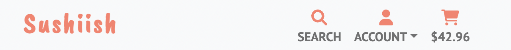
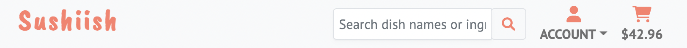
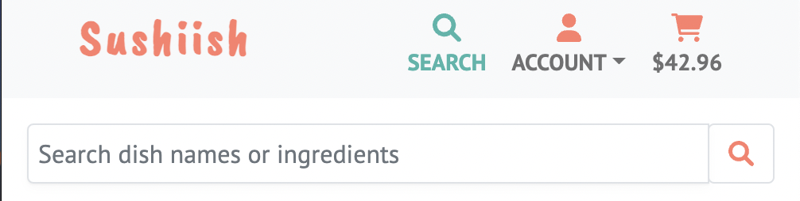
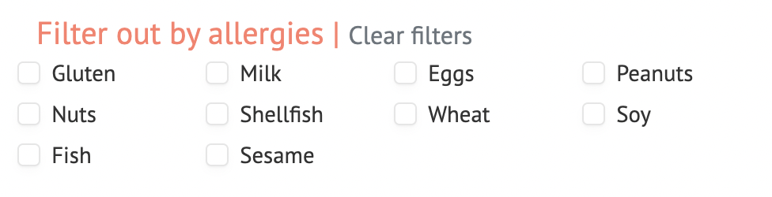
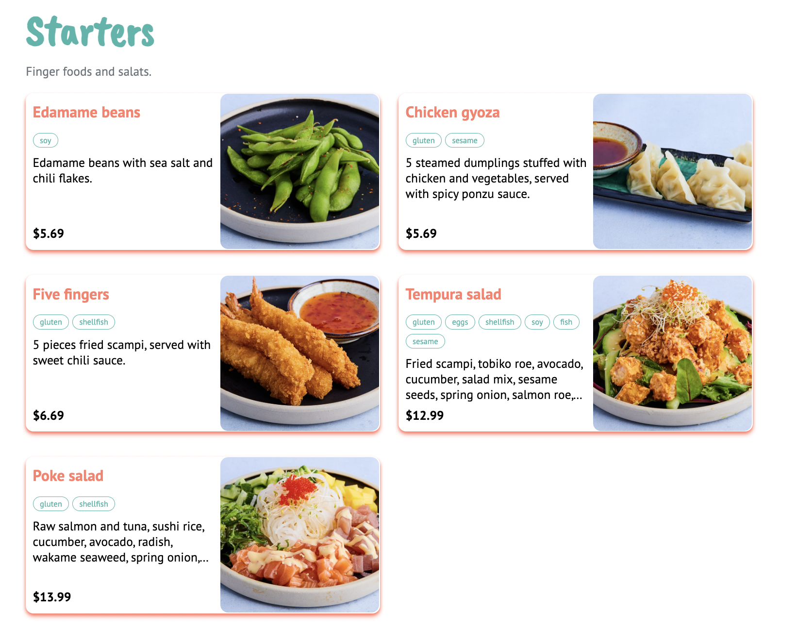
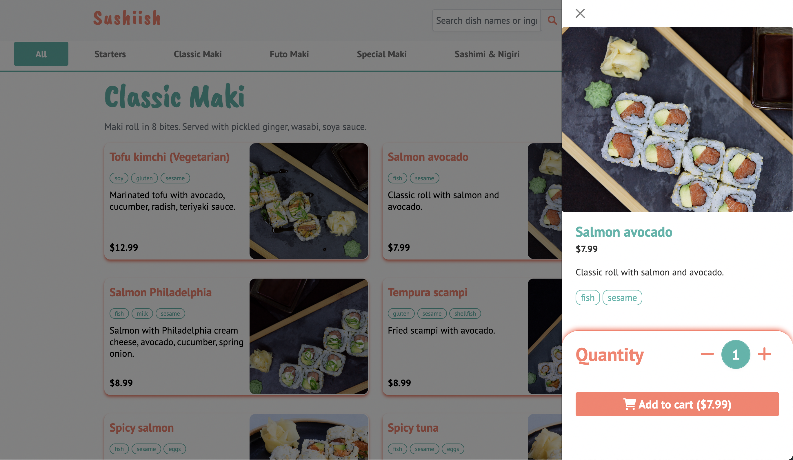
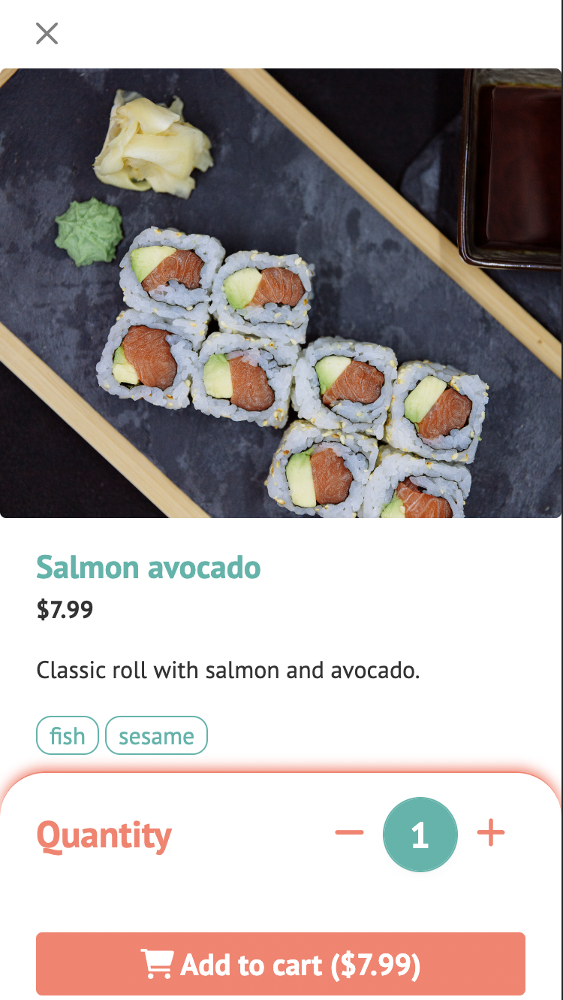
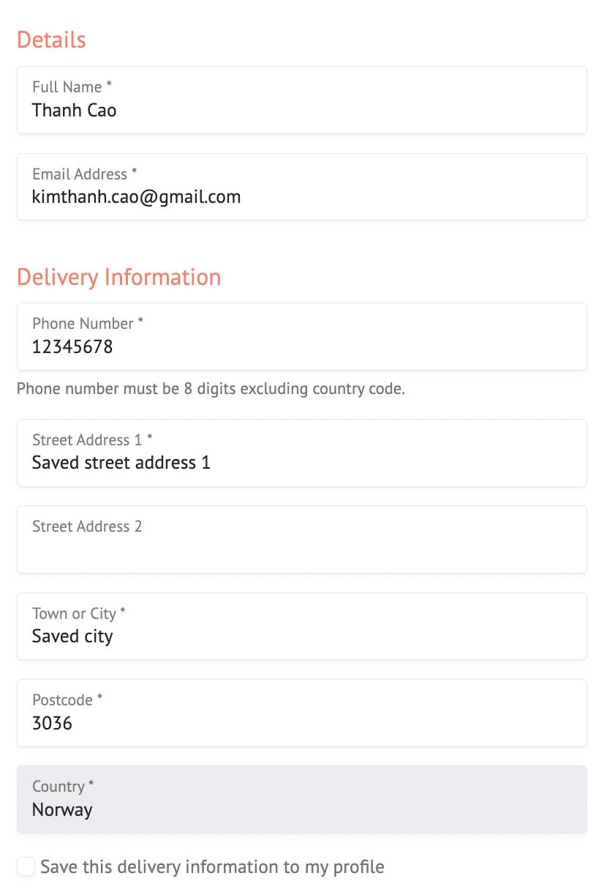

# Existing Features
This section outlines the existing features of the project with screenshots to showcase. Return to main [README.md](README.md) to read more about project's planning, conceptions, technologies used, deployment.

A note in terms of localization: Sushiish is a take away shop located in Oslo, Norway. Because of this, the default field for country is set to Norway and the phone number pattern/validation is a 8-digit number. In terms of currency being used in this app, American dollars ($) is used to make it easier for readers of this project to understand the price point in stead of Norwegian kroner.

## 1. Navigations
* There are two main navigations in the app:
    * **Index navigation**: This is the navigation for the landing page where users can use the links to quick jump to different sections of the landing page: **About, Catering, Contact, Account, and Menu (online shop)**.

*Index navigation desktop*

*Index navigation mobile screen with hamburger dropdown*
    
    * **Online shop**: contains navigation to go to user's profile or authentication (login/logout/registration), and cart. If user is within the menu section, the navigation will show the search box where users can search for a dish name or ingredients. If user is not within the menu section, the navigation will show the icon to quickly go to menu.

*Online shop navigation at product page with search function*

*Online shop navigation with menu icon to go to product page*

* The navigation is also responsive with hamburger icon on index page for mobile devices. In the online shop, the search box is reduced to only a search icon which expands to a full search box upon click.

*Desktop screen navbar with full search box*

*Mobile screen navbar with only search icon which hides/displays search box upon click*
## 2. Responsiveness
* The entire website/webshop is built with responsive design following mobile first approach. It's even catered for the new smaller screen sizes such as Galaxy Fold with breakpoint at 280px. This allows visitors/potential customers/loyal customers to be able to order delicious sushi anywhere, anytime, on any device.

## 3. Landing page
* Landing page is a simple static page in order to introduce what the website is about. Upon landing, visitors can see a hero text with a background image which clearly indicate that this website is about sushi.

* The landing page is divided into 3 sections which help visitors have a clearer understanding the intentions of the website, especially the section introducing Sushiish shop and its catering services.

## 4. Menu / Product app (Sushiish online shop)
### Filters
* There are three possiblity for filters in the menu section:
    * **Search box filter**: This filter allows users to search for a dish name or ingredients. This feature is found on the top navigation bar when user is within the menu page.

    * **Category filter**: Visitors can choose to see all the dishes available at Sushiish. Or they can choose to filter the menu by its category. Currently Sushiish has 7 categories: starters, classic maki, futo maki, special maki,sashimi & nigiri, sushi combo menu, and extras.

    * **Allergy filter**: This filter allows users to filter out dishes by allergy. There are currently 10 allergies which are also some of the most common allergies. Visitors can filter out by one or several allergies. If no allergies are selected, all the dishes will be shown.

* Category filter's position is fixed upon scrolling and acts as a secondary navigation in the product page.

### Product listing
* Product listing is organized in sections accordingly to the category. Each section contains category name and its description, which is then followed by a list of dishes belong to the respective category.

* Each product/dish is presented in card design. Each card contains a picture of the dish, its name, price, product description, and allergy list design as allergy tags.

  
* Upon click each product/dish, offcanvas is triggered to show the product details, positioned on the right side of the screen. The offcanvas is also responsive taking up a part of the screen for big screen size and whole screen for mobile size.
* Offcanvas product details shows the respective product's details and allows buyers to adjust quantity before adding to cart. Upon adjusting quantity, buyers are able to see the expected total price for that respective item.

  
* When click to add item to cart, a success toast message appears to inform buyers that the item has been added to cart or quantity of the existing item has been adjusted.

## 5. Buying cart
* Buying cart is a page where buyers can see all the items they have added to cart. Here they can have a total overview of the order: all the products and quantity they have added to cart, and the total price. buyers are able to adjust quantity of specific order items right here: either increase, decrease or remove the item from the cart.

  
* Order info card shows neccessary information about the order where buyers have to choose before they can proceed to checkout. There are 4 details to be chosen in this stage:
  * Order type: buyers can choose to order as a delivery or pickup. Upon chosing between delivery and pickup, delivery charge is added dynamically to the order price card to inform buyers about the expected total amount to be charged.
  * Expected done date: is limited from today's date to maximum 30 days in the future.
  * Expected done time is limited from 13:15 to 21:00 accordingly to the opening hours of Sushiish shop.
    * Expected done date and time are prefilled with the earliest possible pickup/delivery time: which is 30mins from current now time today. This is to prevent buyers from choosing an unexpected time.
     * If the expected done time is earlier than the opening time, the expected done time will be set to the opening time.
     * If the expected done time is later than the closing time, the expected done time will be set to opening time next day.
  * Optional add note to order feature which allows buyers to send a note to the restaurant regarding the order.

  
* Clicking `Procced to checkout` will redirect the buyers to the checkout page.

## 6. Checkout and payment
* At checkout phase, buyers will have to fill out their information and payment method. If buyer is guest, they will have to fill out theses fields from scratch. If buyer is registered without a presaved address, they will also have to fill out theses fields from scratch. But they have an option to save the this information for later use for convenience. If buyer is registered with a presaved address, all these information will be prefilled.
* The form is checked for validation before submission: all the required fields are filled out, email and phone fields are of valid format.

* Payment is handled by Stripe API. Buyers can choose to pay with card or with Google Pay. Google Pay will redirect buyers to a payment page where they can pay with their Google Pay account. To pay with card, buyers have to fill out a valid payment card. When click to pay, an overlay is shown in order to inform buyers that the shop is processing the payment and prevent them from accidentally clicking the pay button again or other navigation link which could potentially affect the payment process.

* If payment fails, an error toast message will appear to inform buyers that the payment failed. If payment is successful, buyers will be redirected to the order confirmation success page with details of their order.

* If buyers have successfully paid the other with a confirmation of success from stripe, but the order form is not able to handled by the server, there is a webhook set up which hooks into Stripe's payment status in order to attempt saving succesfully paid orders in the database.

## 7. Profile page
* Profile page is a page where buyers can see all the information they have entered in the registration form as well as all the addresses they have saved.
<!-- Insert screenshots -->

* **Personal details:** users can edit their personal details including first name, last name, and email.

* **Saved addresses:** users can add/edit/delete addresses. The logic is set up so that only one address can be set as the default address.

* **Order history:** users can see all the orders they have successfully purchased. Clicking on each order will lead them to the order details page.

## 8. Django admin page
* Django has a really powerful built-in admin page which allows users to manage all the data tables available in the databse.

* Some of the admin views for certain tables are adjusted to display all the neccessary fields in the listing page. Some fields are set to not be able to be editted, such as at the Product table/view, some of the fields that cannot be edited are: create_date and all the price-related fields.

## 9. Other features
* Toast messages: are used to inform users about the status of their actions. There are 4 types of toast messages with different colors and icons:
    * Success: is used to inform users that their actions have been successfully completed.
    * Error: is used to inform users that their actions have failed.
    * Warning: is used to inform users that their actions have failed.
    * Info: is used to inform users about the status of their actions.

*Toast success message design*