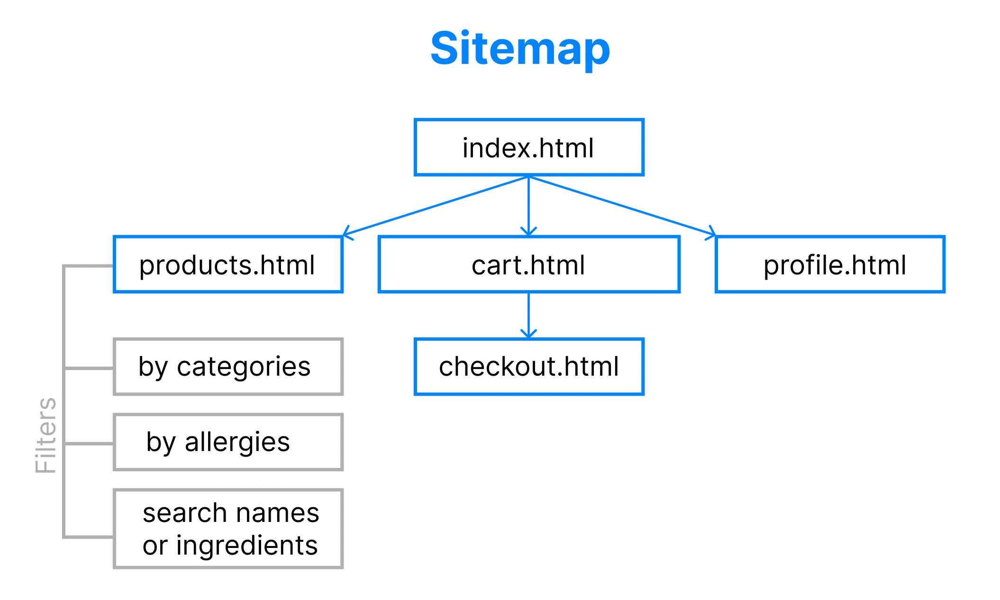

# Sushiish online take-away shop
## Introduction
This is project milestone 4 for Code Institute Full-stack development program: Fullstack frameworks with Django

The purpose of this project is to create an e-commerce shop for a small sushi take-away shop called Sushiish, which allows their customer to be able to pre-order food for pick up or delivery with the ability to pay orders online with Stripe payments in order to reduce the waiting time for customers, and the workload for employees. While Sushiish is a fictional sushi business, its inspiration, menu, and media assets are taken from my own business: a take-away shop selling sushi and wok.

## Showcase


## Table of Contents
  - [User Experience (UX)](#user-experience-ux)
    - [User Stories](#user-stories)
    - [Strategy](#strategy)
    - [Scope](#scope)
    - [Structure](#structure)
      - [Information Architecture](#information-architecture)
      - [Database Design](#database-design)
    - [Skeleton](#skeleton)
      - [Design](#design)
      - [Wireframes](#wireframes)
      - [Design changes](#design-changes)
  - [Features](#features)
    - [Existing features](#existing-features)      
    - [Future implementations](#future-implementations)
  - [Technologies used](#technologies-used)
    - [Languages](#languages)
    - [Programs and Tools](#programs-and-tools)
    - [Frameworks and Libraries](#frameworks-and-libraries)
  - [Testing](#testing)
  - [Deployment](#deployment)
    - [Development](#development)
    - [GitHub Pages](#github-pages)
    - [Cloning the project locally](#cloning-the-project-locally)
    - [Forking the repository](#forking-the-repository)
  - [Credits](#credits)
    - [Code](#code)
    - [Content](#content)
    - [Media](#media)
    - [Acknowledgements](#acknowledgements)

## User Experience (UX)
### User Stories
* As a new visitor and a site user, I want to:
  * know what the website is about upon landing the site.
  * be able to navigate through the website smoothly.
  * be able to sign up / log in / log out in order to order take-away.
  * have a personalized profile page where I can add my delivery information and see my previous purchase history.

* As a shopper during the dish selection phase, I want to:
  * be able to see all the dishes available to buy and filter the dishes based on their categories.
  * exclude the dishes based on certain allergies.
  * search for a dish based on name or descriptions (ingredients).
  * view product's detailed information.
  * able to see the total amout of my current purchase at any time.
* As a shopper during checking out phase, I want to:
  * view all the dishes I have added to my order.
  * easily adjust quantity of a product currently in my order / delete a product
  * be able to add a note to the kitchen or delivery.
  * choose time I expect to pick up the food or have it delivered.
  * easily enter personal information / delivery information / payment information.
  * pay for orders with my card in a safe and secured matter.
  * receive a confirmation from the shop that I have successfully or failed to create an order or pay.

* As the shop owner, I want to:
  * be able to add more dishes to the menu.
  * be able to edit current dishes.
  * delete a dish out of the menu.

### Strategy
Covid-19 era has made online ordering and delivery an important feature and source of intake for restaurant businesses to offer customers a fast, convenient, and contactless way of ordering food. In order to increase Sushiish' competence and attractiveness, it is a must that the shop can offer such services to their customer base. The ordering flow has to be seamless and without much troubles or confusions for ease of use for customers of any age group.

### Scope
1. Content requirements
* Introduction of the shop to give visitors an idea of what this shop is selling
* List of: product categories / products (grouped by categories)
* Detailed information of each product: ingredients, allergies (if any), price, additional options for product.
* Shopping cart:
  * what products have been added to cart - quantity - total price
  * Total amount of the whole shopping cart and delivery charge (if delivery).
* Account information:
  * My profile
  * My purchase history

2. Functionality requirements
* User account:
  * Sign up / Log in
  * Edit profile: personal information / delivery address
* Online shop:
  * Product filtering by categories
  * Product filtering by allergies
  * Search for a product by name or description
  * Product showcase page with thumbnails images
  * Product's details page with full image and more descriptions
* Shopping cart, create an order and payment::
  * View / Edit existing product's quantity / Delete existing product on shopping cart
  * Secured online payment with card through Stripe API
  * Order confirmation email
* Toast messages to inform users if their actions have succeeded or failed
* Admin and store management:
  * CRUD functionalities for product categories
  * CRUD functionalities for products
  * CRUD functionalities for users

### Structure
#### Information Architecture
*Sitemap*

The main goal of this project is to generate sales, it is important to keep it as simple as possible so users can easily navigate themselves within the shop and go to checkout and pay seamlessly without much trouble. Therefore the information architecture of this site is very simple: a landing page where users get an impression what type of site this is. Here, users should easily see the 3 main possible navigations: 
* product listing page (menu) where users can filter the products by categories (appetizers, sashimi & maki, maki, sushi combo)
* account page for logged in user (or navigation to sign up / login page if not logged in)
* shopping basket, which further leads to checkout page where users can fill in information for pickup or delivery and pay securely with their card.
#### Database design
*ER Modelling*

### Skeleton
#### Design
* CSS framework chosen for this project is [Bootstrap v5.1](https://getbootstrap.com/). This framework is chosen for its clean, simple and clear response UI design, which is easy for novice users to navigate and interact with data and database.

* Color: the color scheme for Sushiish is taken from the ingredients of one of the most popular and classic maki roll: salmon avocado roll. Salmon (pinkish shade #FF7E6B) is the main color for primary action and attention while avocado (light green shade #44B5AA) will have a playfull role as highlight element, all on a rice (white #FFFFFF) background.
*Sushiish color schemes*
  
* Font:
  * [Caveat](https://fonts.google.com/specimen/Caveat) is chosen as the font for the logo and being used for hero texts / headlines.
  * [PT Sans](https://fonts.google.com/specimen/PT+Sans) is used for normal text through the website. The text hiery is determined by the use of color and boldness.
  
#### Wireframes
* Wireframes for mobile: [View here](readme-assets/wireframes-mobile.png)
* Wireframes for desktop: [View here](readme-assets/wireframes-desktop.png)
Tablet design will be similar to desktop design with minor differences in order to fit better with the screen property of a tablet such as columns or padding, etc.
#### Design changes

## Features
### Existing Features
Features that have been implemented can be found at [FEATURES.md](FEATURES.md).

### Future Implementations

## Technologies Used
### Languages
* [HTML5](https://developer.mozilla.org/en-US/docs/Web/Guide/HTML/HTML5) - build up layout and content of the application.
* [CSS3](https://developer.mozilla.org/en-US/docs/Web/CSS) - add custom styling and override Bootstrap stylings to fit with the theme of the website.
* [JavaScript](https://www.javascript.com/) - to add interactive functionailities to the app
* [Python](https://www.python.org/) - to build backend functionalities handling data, database interaction, and CRUD functionalities.
  
### Programs and Tools
* [Figma](https://www.figma.com/) -  for wireframe creation.
* [Visual Studio Code](https://code.visualstudio.com/) - the code editor being used to build the project.
* [LucidChart](https://www.lucidchart.com/) - to create database diagram.
* [PicResize](https://picresize.com/) - to resize large images.
* [Glassmorphism CSS Generator](https://ui.glass/generator/) - to generate glassmorphism effects for registration and login page.
* [Chrome DevTools](https://developer.chrome.com/docs/devtools/) - used heavily for debugging during development and testing process.
* [Git](https://git-scm.com/) - the built-in Git feature in VS Code was used for version control and push to github.
* [Github](https://github.com/) - Github is used to store project's code remotely. 
* [Google Fonts](https://fonts.google.com/) - to import the desired fonts for this project
* [Bootstrap Icons](https://icons.getbootstrap.com/) - implement icons for navigation menu, forms, actions.
* [Autoprefixer CSS online](https://autoprefixer.github.io/) - to parse CSS and add vendor prefixes.
* [Heroku](https://www.heroku.com/) - platform being used to deploy the application
* [Stripe](https://stripe.com/) - for handling online payments.
* [Postgresql](https://www.postgresql.org/) - database
* [Amazon Web Services (AWS)](https://aws.amazon.com/) - to host media and static files on the the cloud.
* [W3C Markup Validator](https://validator.w3.org/), [W3C CSS Validator](https://jigsaw.w3.org/css-validator/), [JSHint](https://jshint.com/), [PEP8 online](https://pep8online.com/), [Lighthouse](https://developers.google.com/web/tools/lighthouse/),  - to validate the code syntax and to check the code quality for HTML markup, CSS, JavaScript, Python, and the site overall performance.

### Frameworks and Libraries
* [Bootstrap v5.1](https://getbootstrap.com/) - the responsive front-end framework to build the layout and style the app.
* [Django](https://www.djangoproject.com/) - the core framework that this e-commerce project is built with.
## Testing
Testing can be found in its own section [TESTING.md](TESTING.md)

## Deployment
### Development
1. Environement:
The project was developed using VS Code editor and its integrated version control feature to commit gits, which are then pushed to GitHub in order to store the codes remotely. The project is hosted on Heroku and can be accessed at [http://ms4-sushiish.herokuapp.com/](http://ms4-sushiish.herokuapp.com/).

2. Project management and development workflow:
* Project management: In order to keep track of my own progression and to-dos, I created [a basic kanban project boards](https://github.com/thanh-cao/ms4-sushiish-django/projects) on GitHub. Based on project's user stories, requirements and wireframes, I scope out the tasks accordingly to 3 phases: To do, In progress, and Done.
* Creating issues as a way to keep a list of small things to build / to do / to fix as I go along with developing the big features.
* Branches: I created a branch for each feature, develop on the respective branch, and pushed them to GitHub.
* Git commit conventional message following [Conventional Commits](https://www.conventionalcommits.org/en/v1.0.0/)

### Forking the project
1. Log in to GitHub and navigate to this project's respository: [ms4-sushiish-django](https://github.com/thanh-cao/ms4-sushiish-django).
2. Just above the navigation menu of the repository (above the Settings button), locate the Fork button.
3. The original copy of the repository is now copied on your GitHub account which allows you to view and/or work on the codes without affecting the original work.

### Cloning the project
Follow these steps to clone this project:

1.Log in to GitHub and navigate to this project's respository: [ms4-sushiish-django](https://github.com/thanh-cao/ms4-sushiish-django).
2. Under the navigation menu of the repository, locate and click the button "Code" which shows different options to clone or download.
3. To clone this repository using HTTPS, copy the link under "Clone with HTTPS".
4. Open Git terminal.
5. If needed, change the current workspace to the location where you want the repository to be cloned
6. Type git clone and paste in the URL copied in step 3 and press Enter.

### Setting up the environment for development
1. Create `.env` file:
   * Create a .env file in the project's directory called `sushiish_shop`.
   * Add the following code to the file:
    ``` Python
    STRIPE_PUBLIC_KEY='insert_your_stripe_public_key'
    STRIPE_SECRET_KEY='insert_your_stripe_secret_key'
    STRIPE_WH_SECRET='insert_your_stripe_wh_key'
    SECRET_KEY='insert_your_very_secret_key'
    AWS_ACCESS_KEY_ID='insert_your_aws_access_key'
    AWS_SECRET_ACCESS_KEY='insert_your_aws_secret_access_key'
    EMAIL_HOST_USER='your_email_address_for_sending emails_to_users'
    EMAIL_HOST_PASS='email_password_generated_by_gmail'
    DEBUG=True  # set to False when deploying to Heroku
    ```
    
    * Add `.env` and `__pycache__` to .gitignore to secure your sensitive data.

2. Create virtual environment and install dependencies:
   * Create a virtual environment in the root directory of the project.
   * Type `python3 -m venv .venv` in the terminal and press Enter.
   * Type `source .venv/bin/activate` in the terminal and press Enter.
   * Type `pip install -r requirements.txt` in the terminal and press Enter.
  
3. requirements.txt and Procfile:
   * The currently available `requirements.txt` file from this repo contains the list of dependencies that are required to run this project. If you develop the project further using more packages and dependencies, you can add them to the `requirements.txt` file with the following command in terminal:
    ```
    pip freeze > requirements.txt
    ```
    * The currently available `Procfile` file contains the command `web: gunicorn sushiish.wsgi:application`. It is used to determine which command to run when the app is started on Heroku. If you develop the project further with a different commands to run the app, make adjustment to `Procfile` file accordingly.
    * Push your changes to `requirements.txt` and `Procfile` to GitHub if any.

### Deployment to Heroku
1. Log in to [Heroku](https://www.heroku.com/)
2. On top right corner of the screen, locate the `New` button and the choose `Create new app`.
3. Give a unique name to the app, choose appropriate region, and click `Create`.
4. Access your app dashboard and click on `Deploy`.
5. Under `Deployment method`, choose GitHub and coonect to the respective repository.
6. Enable automatic deployment and click `Deploy`.
7. Set up environment on Heroku by going to `Settings` tab.
8. On `Config Vars` section, click `Reveal Config Vars`
9. Based on `env.py` file, add all the environment variables to the `Config Vars` section.
10. On top right coner of the app's dashboard, locate the button `Open app`. You will be able to see you deployed app with link to live site.

## Credits
### Code

### Content
The content throughout this page is written by me and/or adapted from my own business [Hy's Løren](https://www.hysstreetfood.no/).

### Media
Photos of food and drinks are copyrights from my own business [Hy's Løren](https://www.hysstreetfood.no/).
